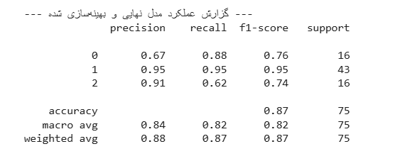

سلام! در حین مرور مباحث یادگیری ماشین، تصمیم گرفتم یک تمرین عملی انجام بدهم. برای این کار دیتاست **"[سلامت خواب و سبک زندگی](https://www.kaggle.com/datasets/uom190346a/sleep-health-and-lifestyle-dataset)"** را انتخاب کردم تا ببینم الگوریتم نزدیکترین همسایه چطور کار می‌کنه.

میتونین کدهای این الگوریتم رو [اینجا](https://colab.research.google.com/drive/1RmQ6fNGe8b4KwWpOZO-epd1k4FxaMTgn?usp=sharing) مشاهده کنین .

من سعی کردم یه مدل پیش بینی کننده برای اینکه چه اختلال خوابی در کاربر ممکنه وجود داشته باشه پیدا کنم دیتا ست من این 3 مدل **"سالم (بدون اختلال)"**، **"آپنه خواب (Sleep Apnea)"** یا **"بی‌خوابی (Insomnia)"** در خودش داشت .

من با ابزار `LabelEncoder` این سه مقدار و مپ کردم به اعداد 0 و1 و 2

در نهایت من مدلم رو با یه نمونه تست کردم توضیح دادم که چه روش هایی وجود داره برای اینکه بفهمیم مدلمون چقدر تونسته خوب پیش بینی کنه

#### **k-NN چیه و چرا بهش می‌گن "تنبل"؟**

این الگوریتم برخلاف خیلی از مدل‌های دیگر «یادگیری» به معنای سنتی نداره. یعنی در زمان آموزش هیچ وزن یا پارامتری یاد نمی‌گیره، بلکه تمام داده‌های آموزشی را در حافظه نگه می‌داره و در زمان پیش‌بینی، تازه شروع می‌کند به محاسبه‌ی فاصله‌ها

#### **خب، این الگوریتم چطوری کار می‌کنه؟**

- **در Classification (طبقه‌بندی):** برای یک داده جدید، KNN فاصله‌ی آن را تا تمام نقاط آموزشی حساب می‌کنه، K همسایه نزدیک‌تر را پیدا می‌کنه و بر اساس **رأی‌گیری اکثریت (Majority Voting)**، کلاس داده‌ی جدید را تعیین می‌کنه.

- **در Regression (رگرسیون):** برای یک داده جدید، KNN پس از پیدا کردن k همسایه نزدیک‌تر، **میانگین (Average)** مقدارِ هدف (Target) آن‌ها را به عنوان خروجیِ پیش‌بینی‌شده برای داده جدید در نظر می‌گیره.

#### **فاصله رو چطور محاسبه میکنه ؟**

##### ۱. فاصله اقلیدسی (Euclidean Distance) - _پیش‌فرض و محبوب‌ترین_

این همان فاصله‌ای است که در مدرسه با خط‌کش یاد گرفتیم؛ یعنی کوتاه‌ترین مسیر مستقیم بین دو نقطه.

- **فرمول:** تفاضل مختصات دو نقطه را به توان ۲ می‌کنیم، با هم جمع می‌کنیم و در نهایت جذر می‌گیریم:
  **کاربرد:** داده‌های پیوسته (مثل سن، وزن، حقوق)؛ به شدت به پیش‌پردازش و مقیاس‌دهی (Scaling) حساسه

##### ۲. فاصله منهتن (Manhattan Distance / Taxicab)

در این روش، حرکت مورب مجاز نیست؛ بلکه باید مسیر را به صورت خطوط افقی و عمودی طی کنیم.

- **فرمول:** قدر مطلق تفاضل مختصات را با هم جمع می‌کنیم (بدون توان ۲ و جذر):
  **کاربرد:** وقتی ابعاد .( تعداد فیچرها ) داده‌ها خیلی زیاده(High Dimensionality)، یا وقتی داده‌ها در یک شبکه شطرنجی قرار دارن

##### ۳. فاصله مینکوفسکی (Minkowski Distance)

این یک فرمول کلی و منعطف است که هر دوتا فرمول بالا رو داره. در این فرمول یک پارامتر به نام p وجود داره:

- اگر p=1 باشه: فرمول تبدیل به **فاصله منهتن** می‌شه.
- اگر p=2 باشه: فرمول تبدیل به **فاصله اقلیدسی** می‌شه.
- **کاربرد:** در کتابخانه Scikit-Learn، کلاس `KNeighborsClassifier` به طور پیش‌فرض از مینکوفسکی با p=2 (یعنی همان اقلیدسی) استفاده می‌کنه، اما شما می‌تونین با تغییر p رفتار آن را عوض کنین.

##### ۴. تشابه کسینوسی (Cosine Similarity / Distance)

این معیار به جای اینکه به **طول یا اندازه** بردارها نگاه کنه، به **زاویه بین آن‌ها** نگاه می‌کنه.

- **تشبیه شهودی:** فرض کنین دو نفر درباره موضوعات مختلف نظر می‌دهن. یکی بسیار پرحرفه و ۱۰۰ کلمه می‌نویسه و دیگری کم‌حرفه و ۱۰ کلمه می‌نویسه. اگر نظراتشون هم‌جهت باشن، زاویه بین بردارهای ذهنی آن‌ها بسیار کوچکه، هرچند که طول نوشته‌هایشون (اندازه بردارها) بسیار متفاوته.
- **کاربرد اصلی:** پردازش زبان طبیعی (NLP)، سیستم‌های توصیه‌گر فیلم/کتاب و تحلیل متون. جایی که تعداد تکرار کلمات مهم نیست، بلکه جهت و مفهوم آن‌ها مهه.

##### ۵. فاصله همینگ (Hamming Distance)

این فاصله برای **داده‌های دسته‌بندی‌شده (Categorical) یا باینری (۰ و ۱)** استفاده می‌شه. کار آن بسیار ساده است: تعداد جاهایی که دو رشته یا دو ویژگی با هم متفاوتن را می‌شماره.

- **مثال:**
- رشته اول: `1 0 1 1 1 0 1`
- رشته دوم: `1 0 0 1 0 0 1`
- اگر مقایسه کنین، این دو رشته در ستون‌های ۳ و ۵ با هم فرق دارن. پس فاصله همینگ آن‌ها برابر با **۲** است.
- **کاربرد:** تصحیح خطای شبکه، مقایسه کدهای ژنتیکی (DNA)، و داده‌های غیرعددی که به صورت Categorical (مثل رنگ چشم: آبی، قهوه‌ای، سبز) هستند.

#### **تنظیمات اصلی k-NN**

عملکرد این الگوریتم به دو تا تنظیم مهم بستگی داره:

- **`k` (تعداد همسایه ها):** اینکه چند تا از نزدیک‌ترین همسایه‌ها رو برای رأی‌گیری انتخاب کنیم، خیلی مهمه.

- **اگه `k` خیلی کوچیک باشه (مثلاً ۱):** مدل خیلی روی حرف یک نفر حساب می‌کنه و ممکنه نظر اون یک نفر اشتباه یا پرت باشه (به این میگن Overfitting).

- **اگه `k` خیلی بزرگ باشه:** انگار داریم نظر کل محله رو می‌پرسیم! اینطوری نظر رفیق‌های صمیمی و اصلی گم می‌شه و مدل بیش از حد ساده فکر می‌کنه (به این میگن Underfitting). پس باید یک `k` بهینه پیدا کنیم که معمولاً با روش‌هایی مثل Cross-Validation انجام می‌شه.

#### **نقاط قوت و ضعفش چیه؟**

- **نقاط قوت:** فهمیدنش خیلی راحته، پیاده‌سازیش ساده‌ست و برای داده‌هایی که الگوهای پیچیده و غیرخطی دارن، خوب عمل می‌کنه.

- **نقاط ضعف:** موقع پیش‌بینی یکم تنبله چون باید فاصله رو با همه حساب کنه. خیلی هم به مقیاس داده‌ها حساسه (پس **حتماً** باید قبلش داده‌ها رو نرمال یا استاندارد کنید!).

#### KNN کی خوب است؟

KNN معمولاً وقتی خوب جواب می‌ده که:

- دیتاست خیلی بزرگ نباشه
- ویژگی‌ها عددی باشن
- مقیاس ویژگی‌ها قابل کنترل باشه
- مرز تصمیم‌گیری خیلی پیچیده نباشن
- داده‌ها نویز خیلی شدید نداشته باشن

#### کاربردهای رایج

- طبقه‌بندی ساده
- baseline اولیه
- recommendation systems
- imputation / پر کردن داده‌های گمشده
- تشخیص الگوهای نزدیک به هم

#### ) مهم‌ترین نکته‌ی KNN:

در `KNN`، مقیاس ویژگی‌ها خیلی مهمه، چون این الگوریتم بر اساس **فاصله** تصمیم می‌گیره. اگر یک ستون بازه‌اش `0..1` باشه و ستون دیگر `0..100000`، عملاً ستون دوم همه‌چیز را کنترل می‌کنه.

پس معمولاً قبل از `KNN` باید داده را `scale` کنیم. دو روش رایج:

##### 1. `StandardScaler`

تصور کنین یک خط‌ کش دارین که از صفر تا یک مدرج شده . کار `MinMaxScaler` این که کوچک‌ترین مقدار هر ستون را برداره و بگذاره روی صفر (0)، بزرگ‌ترین مقدار را بگذاره روی یک (1)، و بقیه عددها را هم بین این دو پخش کنه.

- به کمترین و بیشترین مقدار دیتای شما نگاه می‌کنه.
- **بسیار حساس به داده‌های پرت (Outlier) است.** اگر یک خانه با متراژ ۱۰,۰۰۰ متر داشته باشین، بقیه خانه‌ها همگی به صفر نزدیک می‌شن و خراب می‌شن.

##### 2. `MinMaxScaler`

این روش به جای اینکه همه را به زور بین ۰ و ۱ بچپاند، طور دیگری نگاه می‌کنه. از خودش می‌پرسه: **«میانگین و حد وسط این جامعه چقدره؟ و این چقدر با بقیه فرق داره؟»**

- به میانگین (وسط) و میزان پخش‌شدگی دیتا نگاه می‌کنه
- نسبت به Outlier مقاوم‌تره . داده‌های پرت کل سیستم را خراب نمی‌کنن، فقط خودشان یک عدد مثبت بزرگ (مثلا 8+) می‌گیرن

در اکثر مواقع، **StandardScaler** انتخاب امن‌تر و بهتری هست؛ چون در دیتای واقعی همیشه داده‌های پرت یا عجیب وجود دارن و ما نمی‌خواهیم این داده‌ها مقیاس بقیه داده‌های خوبمان را خراب کنن

#### **چطوری بفهمیم مدل خوب کار کرده؟**

برای اینکه بفهمیم مدل چقدر خوب کار می‌کنه، فقط به دقت (Accuracy) نگاه نمی‌کنیم، چون گاهی گولمون می‌زنه. به جاش از معیارهای کامل‌تری مثل **Precision** و **Recall** استفاده می‌کنیم تا بفهمیم مدل دقیقاً کجاها خوبه و کجاها اشتباه می‌کنه.

### **تحلیل نتایج نهایی: **

بعد از تمیزکاری و بهینه‌سازی با `GridSearchCV`، مدل نهایی من به دقت کلی **۸۷٪** رسید. این عدد برای شروع خیلی خوبه، اما داستان اصلی وقتی شروع شد که به جزئیات گزارش عملکرد نگاه کردم.

اولین چیزی که متوجه شدم این بود که داده‌های من **نامتعادل (imbalanced)** بودند. یعنی تعداد نمونه‌ها برای کلاس‌های مختلف (انواع اختلال خواب) یکسان نبود. این موضوع مستقیماً روی عملکرد مدل تاثیر گذاشته بود:

- مدل من در تشخیص کلاس اکثریت (کلاس ۱) خوب بود و تقریباً در ۹۵٪ موارد درست عمل می‌کرد.

- اما برای کلاس‌های اقلیت (کلاس ۰ و ۲) داستان کمی فرق داشت. مثلاً برای کلاس ۲، مدل من خیلی دقیق بود (وقتی می‌گفت "این کلاس ۲ است"، به احتمال زیاد درست می‌گفت)، اما در پیدا کردن تمام موارد کلاس ۲ ضعف داشت و حدود ۳۸٪ از آن‌ها را از دست می‌داد (Recall پایین).

**نتیجه کلیدی:** این تجربه به من یاد داد که **دقت (Accuracy) به تنهایی معیار خوبی نیست.** در مسائل دنیای واقعی، مخصوصاً در حوزه سلامت، باید به معیارهایی مثل **Recall** توجه ویژه‌ای کنیم تا مطمئن شویم موارد مهم را از دست نمی‌دهیم.

### **چه کارهای دیگری می‌شد انجام داد؟**

برای اینکه این پروژه تمیزتر و حرفه‌ای‌تر بشود، چند قدم دیگر هم وجود داشت که می‌شد برداشت:

- **مدیریت داده‌های نامتعادل:** می‌شد از تکنیک‌های پیشرفته‌تری مانند **SMOTE** برای تولید نمونه‌های مصنوعی برای کلاس‌های اقلیت استفاده کرد تا مدل بتواند از آن‌ها بهتر یاد بگیرد.

- **آزمایش مدل‌های پیچیده‌تر:** من از k-NN استفاده کردم که ساده و عالی است. اما برای پیدا کردن الگوهای پیچیده‌تر، می‌شد مدل‌های دیگری مانند **`RandomForest`** یا **`XGBoost`** را هم امتحان کرد.

- **تحلیل عمیق‌تر اهمیت ویژگی‌ها:** بعد از ساخت مدل، می‌شد با تکنیک‌هایی مانند **`Permutation Importance`** دقیقاً فهمید که کدام ویژگی‌ها (مثلاً سطح استرس، ساعت خواب یا فعالیت بدنی) بیشترین نقش را در تصمیم‌گیری مدل داشته‌اند. این کار برای دادن پیشنهادهای هوشمندانه به کاربر در یک اپلیکیشن واقعی، حیاتی است.

#### **حرف آخر**

خلاصه که k-NN یه الگوریتم باحال و ساده‌ست که بر اساس ایده "نزدیک ترین همسایه " کار می‌کنه! برای شروع خیلی عالیه و می‌تونه نتایج خوبی بده، به شرطی که تنظیماتش رو درست انجام بدید و حواستون به آماده‌سازی داده‌ها باشه.
