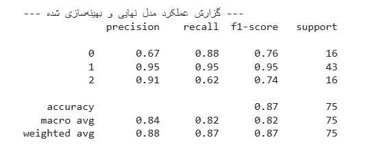

سلام! در حین مرور مباحث یادگیری ماشین، تصمیم گرفتم یک تمرین عملی انجام بدهم. برای این کار دیتاست **"[سلامت خواب و سبک زندگی](https://www.kaggle.com/datasets/uom190346a/sleep-health-and-lifestyle-dataset)"** را انتخاب کردم تا ببینم الگوریتم نزدیکترین همسایه چطور کار می‌کنه.
میتونین کدهای این الگوریتم رو [اینجا](https://colab.research.google.com/drive/1RmQ6fNGe8b4KwWpOZO-epd1k4FxaMTgn?usp=sharing) مشاهده کنین .

من سعی کردم یه مدل پیش بینی کننده برای اینکه چه اختلال خوابی در کاربر ممکنه وجود داشته باشه پیدا کنم دیتا ست من این 3 مدل **"سالم (بدون اختلال)"**، **"آپنه خواب (Sleep Apnea)"** یا **"بی‌خوابی (Insomnia)"** در خودش داشت .
من با ابزار `LabelEncoder` این سه مقدار و مپ کردم به اعداد 0 و1 و 2

در نهایت من مدلم رو با یه نمونه تست کردم توضیح دادم که چه روش هایی وجود داره برای اینکه بفهمیم مدلمون چقدر تونسته خوب پیش بینی کنه

#### **k-NN چیه و چرا بهش می‌گن "تنبل"؟**

ایده اصلی k-NN یکی از ساده‌ترین و باحال‌ترین ایده‌ها توی دنیای ماشین لرنینگه. دقیقاً مثل شعر معروف خودمون: "تو اول بگو با کیان زیستی / من آن گه بگویم که تو کیستی". این الگوریتم برای اینکه بفهمه یک داده جدید به کدوم دسته تعلق داره، به نزدیک‌ ترین دوست‌ها و همسایه‌هاش نگاه می‌کنه.

بهش "یادگیری تنبل" (Lazy Learning) هم می‌گن، چون واقعاً مرحله "آموزش" خاصی نداره. به جای اینکه مثل یک دانش‌آموز درس‌خوان، یک فرمول کلی از داده‌ها یاد بگیره، کل داده‌ها رو به خاطر می‌سپاره و تمام کار اصلی رو موقع پیش‌بینی (لحظه امتحان!) انجام می‌دهه.

#### **خب، این الگوریتم چطوری کار می‌کنه؟**

فرض کنید یک نفر جدید وارد جمع شما می‌شه و نمی‌شناسیدش. k-NN برای شناختن این فرد، دقیقاً این مراحل رو طی می‌کنه:

1.  **محاسبه صمیمیت:** فاصله (یا همون صمیمیت) فرد جدید رو با تمام افراد دیگه‌ای که از قبل می‌شناختیم، اندازه می‌گیره.
2.  **پیدا کردن نزدیک‌ترین رفیق‌ها:** `k` نفر از نزدیک‌ترین افراد (مثلاً ۵ نفر) رو به عنوان "رفقای صمیمی" فرد جدید انتخاب می‌کنه.
3.  **رأی‌گیری:** از این `k` رفیق می‌پرسه که به کدوم دسته تعلق دارن. هر دسته‌ای که بیشترین رأی رو بیاره، به عنوان برچسب فرد جدید انتخاب می‌شه. به همین سادگی!

#### **تنظیمات اصلی k-NN**

عملکرد این الگوریتم به دو تا تنظیم مهم بستگی داره:

- **`k` (تعداد رفیق‌ها):** اینکه چند تا از نزدیک‌ترین همسایه‌ها رو برای رأی‌گیری انتخاب کنیم، خیلی مهمه.

  - **اگه `k` خیلی کوچیک باشه (مثلاً ۱):** مدل خیلی روی حرف یک نفر حساب می‌کنه و ممکنه نظر اون یک نفر اشتباه یا پرت باشه (به این میگن Overfitting).
  - **اگه `k` خیلی بزرگ باشه:** انگار داریم نظر کل محله رو می‌پرسیم! اینطوری نظر رفیق‌های صمیمی و اصلی گم می‌شه و مدل بیش از حد ساده فکر می‌کنه (به این میگن Underfitting). پس باید یک `k` بهینه پیدا کنیم که معمولاً با روش‌هایی مثل Cross-Validation انجام می‌شه.

- **متریک فاصله (خط‌کش اندازه‌گیری صمیمیت):** اینکه چطوری "نزدیکی" رو اندازه بگیریم هم مهمه. دو تا از معروف‌ترین "خط‌کش‌ها" این‌ها هستن:

  - **فاصله اقلیدسی (Euclidean):** همون فاصله خط صاف و مستقیم بین دو نقطه.
  - **فاصله منهتن (Manhattan):** فاصله حالت "تاکسی" توی یک شهر شطرنجی.

#### **نقاط قوت و ضعفش چیه؟**

- **نقاط قوت:** فهمیدنش خیلی راحته، پیاده‌سازیش ساده‌ست و برای داده‌هایی که الگوهای پیچیده و غیرخطی دارن، خوب عمل می‌کنه.
- **نقاط ضعف:** موقع پیش‌بینی یکم تنبله چون باید فاصله رو با همه حساب کنه. خیلی هم به مقیاس داده‌ها حساسه (پس **حتماً** باید قبلش داده‌ها رو نرمال یا استاندارد کنید!).

#### **چطوری بفهمیم مدل خوب کار کرده؟**

برای اینکه بفهمیم مدل چقدر خوب کار می‌کنه، فقط به دقت (Accuracy) نگاه نمی‌کنیم، چون گاهی گولمون می‌زنه. به جاش از معیارهای کامل‌تری مثل **Precision** و **Recall** استفاده می‌کنیم تا بفهمیم مدل دقیقاً کجاها خوبه و کجاها اشتباه می‌کنه.

### **تحلیل نتایج نهایی: **

بعد از تمیزکاری و بهینه‌سازی با `GridSearchCV`، مدل نهایی من به دقت کلی **۸۷٪** رسید. این عدد برای شروع خیلی خوبه، اما داستان اصلی وقتی شروع شد که به جزئیات گزارش عملکرد نگاه کردم.

اولین چیزی که متوجه شدم این بود که داده‌های من **نامتعادل (imbalanced)** بودند. یعنی تعداد نمونه‌ها برای کلاس‌های مختلف (انواع اختلال خواب) یکسان نبود. این موضوع مستقیماً روی عملکرد مدل تاثیر گذاشته بود:

- مدل من در تشخیص کلاس اکثریت (کلاس ۱) خوب بود و تقریباً در ۹۵٪ موارد درست عمل می‌کرد.
- اما برای کلاس‌های اقلیت (کلاس ۰ و ۲) داستان کمی فرق داشت. مثلاً برای کلاس ۲، مدل من خیلی دقیق بود (وقتی می‌گفت "این کلاس ۲ است"، به احتمال زیاد درست می‌گفت)، اما در پیدا کردن تمام موارد کلاس ۲ ضعف داشت و حدود ۳۸٪ از آن‌ها را از دست می‌داد (Recall پایین).

**نتیجه کلیدی:** این تجربه به من یاد داد که **دقت (Accuracy) به تنهایی معیار خوبی نیست.** در مسائل دنیای واقعی، مخصوصاً در حوزه سلامت، باید به معیارهایی مثل **Recall** توجه ویژه‌ای کنیم تا مطمئن شویم موارد مهم را از دست نمی‌دهیم.

### **چه کارهای دیگری می‌شد انجام داد؟**

برای اینکه این پروژه تمیزتر و حرفه‌ای‌تر بشود، چند قدم دیگر هم وجود داشت که می‌شد برداشت:

- **مدیریت داده‌های نامتعادل:** می‌شد از تکنیک‌های پیشرفته‌تری مانند **SMOTE** برای تولید نمونه‌های مصنوعی برای کلاس‌های اقلیت استفاده کرد تا مدل بتواند از آن‌ها بهتر یاد بگیرد.
- **آزمایش مدل‌های پیچیده‌تر:** من از k-NN استفاده کردم که ساده و عالی است. اما برای پیدا کردن الگوهای پیچیده‌تر، می‌شد مدل‌های دیگری مانند **`RandomForest`** یا **`XGBoost`** را هم امتحان کرد.
- **تحلیل عمیق‌تر اهمیت ویژگی‌ها:** بعد از ساخت مدل، می‌شد با تکنیک‌هایی مانند **`Permutation Importance`** دقیقاً فهمید که کدام ویژگی‌ها (مثلاً سطح استرس، ساعت خواب یا فعالیت بدنی) بیشترین نقش را در تصمیم‌گیری مدل داشته‌اند. این کار برای دادن پیشنهادهای هوشمندانه به کاربر در یک اپلیکیشن واقعی، حیاتی است.

#### **حرف آخر**

خلاصه که k-NN یه الگوریتم باحال و ساده‌ست که بر اساس ایده "رفیق‌بازی" کار می‌کنه! برای شروع خیلی عالیه و می‌تونه نتایج خوبی بده، به شرطی که تنظیماتش رو درست انجام بدید و حواستون به آماده‌سازی داده‌ها باشه.
