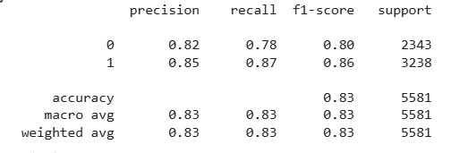

چند وقت پیش تصمیم گرفتم چن تا تمرین توی حوزه یادگیری ماشین داشته باشم و سعی کردم با رگرسیون لجستیک یه مدل پیش بینی کننده احتمال افسردگی دانش آموزان با دیتاست که از [اینجا](https://www.kaggle.com/datasets/hopesb/student-depression-dataset/data) میتونین اطلاعات بیشتر درموردش رو مشاهده کنید طراحی کنم خروجی ارزیابی مدل من رو مشاهده میکنین :

کد رو هم میتونین [اینجا](https://colab.research.google.com/drive/1Cxp8LbWGPYdzxokOJzlEPzbkiG8_25K9#scrollTo=nm_Oy6ykz-e9) دانلود کنین .
